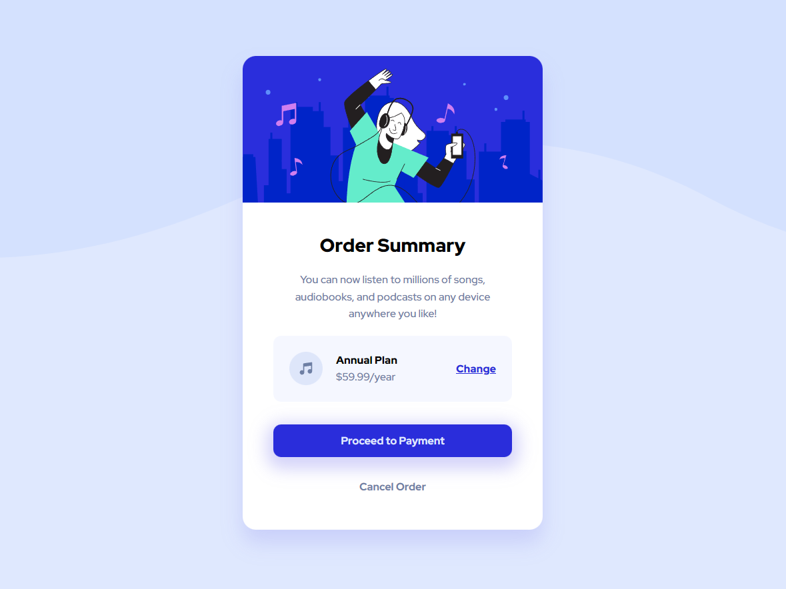

# Frontend Mentor - Order summary card solution

This is a solution to the [Order summary card challenge on Frontend Mentor](https://www.frontendmentor.io/challenges/order-summary-component-QlPmajDUj). Frontend Mentor challenges help you improve your coding skills by building realistic projects.

### Screenshot

  

### Links

- Solution URL: [Here](https://www.frontendmentor.io/challenges/order-summary-component-QlPmajDUj)
- Live Site URL: [Here](https://robertzelic.github.io/order-summary-component/)

### Built with

- Semantic HTML5 markup
- CSS custom properties
- Flexbox
- Desktop-first workflow
