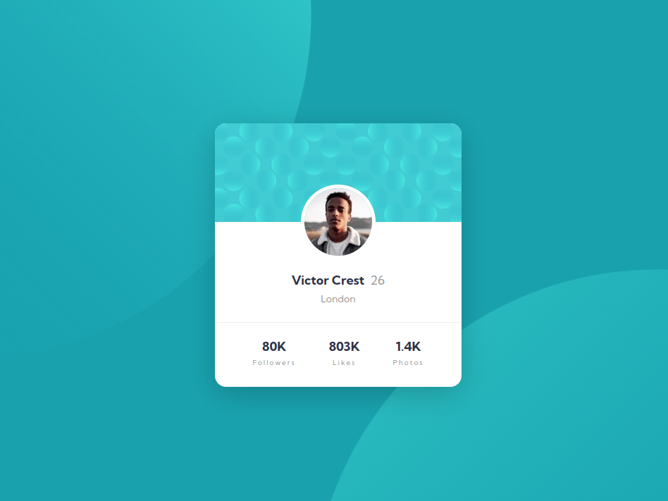

# Frontend Mentor - Profile card component solution

This is a solution to the [Profile card component challenge on Frontend Mentor](https://www.frontendmentor.io/challenges/profile-card-component-cfArpWshJ). Frontend Mentor challenges help you improve your coding skills by building realistic projects.

### The challenge

- Build out the project to the designs provided

### Screenshot

  

### Links

- Solution URL: [Here](https://www.frontendmentor.io/challenges/profile-card-component-cfArpWshJ)
- Live Site URL: [Here](https://robertzelic.github.io/profile-card-component)

## My process

### Built with

- Semantic HTML5 markup
- CSS custom properties
- Flexbox
